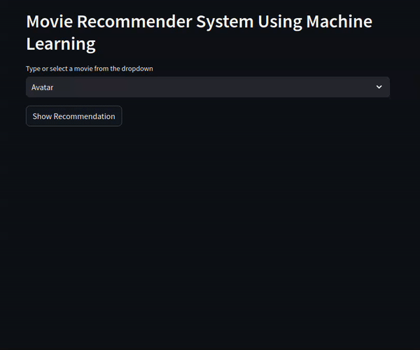

# Cine_match

> CineMatch is a movie recommendation system built using machine learning. It utilizes the cosine similarity metric to recommend movies based on user-selected preferences. The application is developed using Streamlit to create an interactive web interface and leverages The Movie Database (TMDb) API to fetch movie posters.

- Demo: https://mycinematch-8be0ed558c56.herokuapp.com/



## Features
- Movie Recommendation: Recommends movies based on similarity to a selected movie.
- Interactive Interface: Users can select a movie from a dropdown menu and get personalized recommendations.
- Poster Display: Displays the posters of recommended movies for a more visual experience.

## Installation

1. Clone the repository:

```bash
git clone git@github.com:yahia-adam/cine_match.git
cd cine_match
```
2. Install dependencies:

```bash
pip install -r requirements.txt && unzip artifacts.zip
```
3. Run the application:

```bash
streamlit run app.py
```

## Docker Setup
To containerize the CineMatch application using Docker:

1. Build the Docker image:

```bash
docker build -t cinematch .
```

2. Run the Docker container:
```bash
docker run -p 8501:8501 cinematch
```
The application will be accessible at http://localhost:8501.
